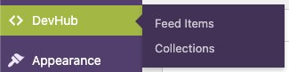
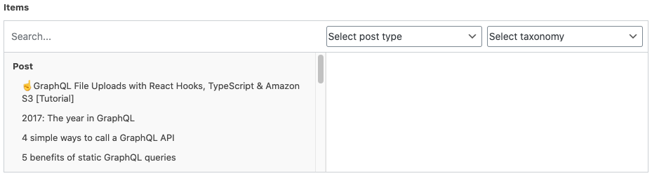

# Welcome to DevHub

DevHub is a place for developers to explore the latest resources for building apps with Apollo. It allows us to organize the best resources—blogs, videos, docs, and more—about a particular subject into hand-picked collections. This document explains how to update the website and create new collections.

- [Developing locally](#developing-locally)
- [Running Wordpress locally](#running-wordpress-locally)
  - [Recommended method](#recommended-method)
- [In this repo](#in-this-repo)
- [In Wordpress](#in-wordpress)
  - [Feed items](#feed-items)
  - [Collections](#collections)
- [Twitch streams](#twitch-streams)

## Developing locally

To run this website locally, first clone the repo into a new directory and install its dependencies:

```bash
git clone https://github.com/apollographql/devhub.git
cd devhub
npm install
```

Next, install the [Netlify CLI](https://docs.netlify.com/cli/get-started/) if you don't already have it installed on your computer, and run `netlify init`. Select the options **Connect this directory to an existing Netlify site** and **Use current git remote origin** to connect your local environment with the appropriate Netlify site automatically.

We use `netlify dev` to start the local development server with important environment variables automatically injected into the build.

```bash
npm install -g netlify-cli # if you don't have it already
netlify login # if you just installed the CLI
netlify init # only required for newly-cloned repos
netlify dev # use this instead of `npm start`
```

By default, this will run the website locally with data sourced from our production Wordpress instance. Don't worry, you can't write any new data to the prod instance from here. 😅

## Running Wordpress locally

If you want to load your data from a local Wordpress instance, simply supply a `WORDPRESS_URL_DEV` environment variable when you start the local development environment. You could do this by writing it inline before `netlify dev`:

```bash
WORDPRESS_URL_DEV=http://localhost:10000/graphql netlify dev
```

Or you could create a `.env` file in the project root with a `WORDPRESS_URL_DEV` environment variable set. Just run `netlify dev` and the variable will be loaded automatically. 

```bash
WORDPRESS_URL_DEV=http://localhost:10000/graphql
```

### Recommended method

The easiset way to run Wordpress locally is through the [Local](https://localwp.com/) app. It works on all platforms and makes provisioning Wordpress instances and keeping them updated with your production instances easy.

Our production Wordpress instance is hosted on WP Engine. To pull its data down to your local instance, you can follow [this guide](https://wpengine.com/support/local/#Pull_to_Local_From_WP_Engine) on the subject. The WP Engine login credentials are stored in 1Password.

Once you have your Wordpress instance running, you should see its address and port in the Local UI. Your `WORDPRESS_DEV_URL` should be this address and port, followed by the path `/graphql`. For example, http://localhost:10000/graphql.

## In this repo

This repo contains the code responsible for sourcing data and rendering it on the page. It also contains things like titles and static page content, like the home page title and description.

It uses [Chakra UI](https://github.com/chakra-ui/chakra-ui) components and CSS solution with a custom theme made with colors and icons from [Space Kit](https://github.com/apollographql/space-kit). Chakra helps us build layouts quickly and consistently using their convenient style props system and a theme for adhering to a set of spacing units, color palettes, and component styles. You can learn more about writing CSS with Chakra by [reading this docs article](https://next.chakra-ui.com/docs/features/style-props).

The dynamic data in this website is sourced from a Wordpress instance using [`gatsby-source-wordpress-experimental`](https://github.com/gatsbyjs/gatsby-source-wordpress-experimental). This makes all of the data in Wordpress available to be queried using static GraphQL queries. These queries are usually expressed as [Gatsby page queries](https://www.gatsbyjs.com/docs/page-query/) defined as named exports at the bottom of a file. See the [collections page](./src/pages/collections.js) for example.

## In Wordpress

All of the dynamic data in this website lives in Wordpress. To update this content, first [log in to Wordpress](https://wp.apollographql.com/wp-admin). In the Wordpress backend, on the left side of the page, you'll find a DevHub menu item (pictured below) with links to manage feed items and collections.



If you need access to Wordpress, please let us know in the #team-dx Slack channel and somebody will set that up for you. 🎉

### Feed items

All [streams](#twitch-streams) and blog posts will automatically appear in the feed on DevHub, but other types of content like videos, courses, or external blog posts must be added manually. In addition, any collection items that are _not_ Apollo blog posts must be added as feed items first, even if they don't appear in the feed.

To create a feed item, click the "Feed Items" menu option, and then the "Add New" button at the top of the feed items page. All feed items must have a title, and will usually have a URL. There are a few other options for feed items:

| Option | Description |
| - | - |
| Excerpt | A short description about the linked content or misc. text |
| Show in feed? | Is this feed item only for a collection or should it also appear in the feed? |
| Is paid? | Flag for paid content |
| Page URL | The URL where the content lives |
| Author | The name of the person who created the content |

### Collections

Collections are sets of feed items and blog posts that usually share a common theme or subject. They're meant to grow and evolve over time as new content is made or old content becomes less relevant.

To create or edit collections, first click on the "Collections" menu item from the DevHub menu in the sidebar. Next, click the "Add New" button or any collection title in the table on the collections page.

Collections consist of these main pieces:

1. A title
2. A description of the topics that the collection covers, and why they're important
3. Categories: Select one or more general topic areas (backend, frontend, platform, etc.)
4. An excerpt: This is the quote from the collection author—a short endorsement or explanation of what readers should hope to learn from it
5. Items: A selection of feed items and blog posts chosen by filtering and clicking on rows in the left side of the widget (pictured below)



A few hints about using the items widget:

- If you know the title of the post you want to add, use the search input at the top of the widget to narrow down your list of posts
- If you are trying to add a custom feed item, use the "Select post type" dropdown at the top of the widget to select "Feed Item", and then browse the list on the left for your item
- If the widget search results are too numerous to browse by hand, your browser's "Find" feature can come in handy 🤓

#### Unlisted collections

Collections are listed on the DevHub home and collections pages by default, but you can hide them from these pages by making a collection **unlisted**. Check the box at the bottom of any collection editor in Wordpress, and your collection will be hidden from these index pages, but still accessible by its URL. The URL scheme for all collections looks like this:

```
https://www.apollographql.com/devhub/collection/YOUR-SLUG
```

## Twitch streams

The only dynamic content _not_ managed in Wordpress is the automatic addition of past Twitch streams to the feed. This content is sourced at build time using `gatsby-source-apiserver` with the Twitch API.
